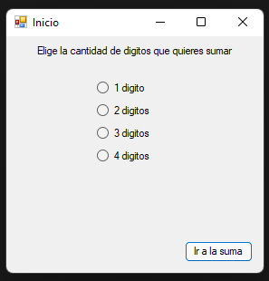
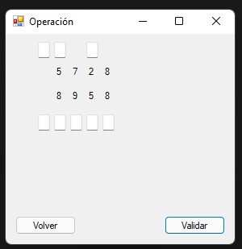

# Aplicación Suma

Aplicación que pide realizar una suma de números aleatorios y comprueba el resultado, incluyendo los acarreos.

> Se hizo como parte de una tarea para la universidad.

## Imágenes

## Licencia

Este proyecto está bajo la licencia MIT, para más información haz [click aquí](./LICENSE).
